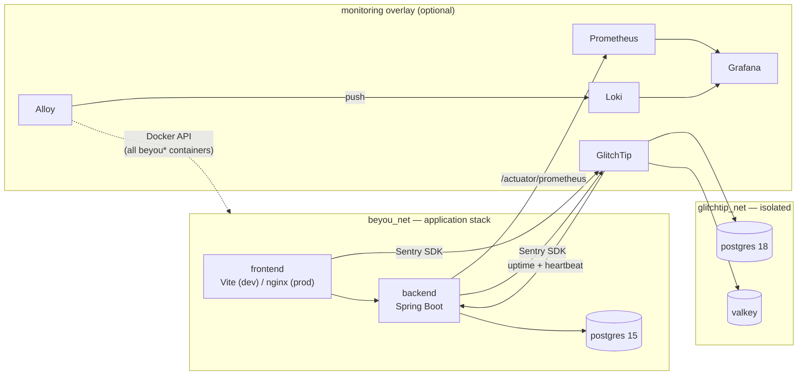

<p align="center">
  
</p>

<h1 align="center">BeYou — Dev Environment</h1>

<p align="center">
  Docker Compose orchestration for the whole BeYou stack.<br>
  One command brings up Postgres, the Spring Boot API, and the web client — plus an optional observability overlay.
</p>

<p align="center">
  
  
  
  
  
  
</p>

---

BeYou is a gamified personal-productivity app — habits, goals, routines, tasks, and categories, with XP and
streaks on top. It lives across several repositories. **This one contains no application code.** It is the
Compose layer that assembles the others into something you can actually run: locally with hot reload, as a
production-like stack from published images, or as an isolated stack for the Playwright suite.

## Highlights

- **Composable overlays, not four separate stacks** — a base file defines Postgres and the shared network;
  `dev`, `prod`, `e2e`, and `monitoring` overlays layer on top of it. The monitoring overlay is the *same file*
  in development and production, so what you debug locally is what runs deployed.
- **Hot reload in dev** — the backend and frontend source trees are bind-mounted; build artefacts
  (`target/`, `node_modules/`, the Maven repo) live in named volumes so host and container tooling never
  fight over the same directory.
- **Production-like mode from published images** — pulls `ghcr.io/anddev741/beyou-*`, serves the web build
  through nginx, and keeps containers current with Watchtower.
- **Three observability questions, three answers** — Prometheus for *how is it performing*, Loki for
  *what happened*, GlitchTip for *what broke*. All three surface in one Grafana.
- **Loopback by default** — every administrative surface (Grafana, Prometheus, GlitchTip, Alloy, the actuator)
  publishes to `127.0.0.1` only. Reach them through a tunnel or reverse proxy, not by widening the binding.

## Architecture



GlitchTip's web container is deliberately dual-homed: it needs `beyou_net` to poll the backend's management
port, but its own datastores stay off the application network.

## Prerequisites

- Docker Engine or Docker Desktop with the `docker compose` v2 plugin
- Git
- `openssl` (for generating secrets), only if you run the monitoring overlay

## Getting started

### 1. Clone the repositories side by side

The dev overlay builds the backend and frontend from **sibling directories**, so the layout matters.

```bash
git clone https://github.com/AndDev741/Beyou-dev-env.git
git clone https://github.com/AndDev741/Beyou-backend-spring.git
git clone https://github.com/AndDev741/Beyou-Frontend.git
```

```
your-workspace/
├── Beyou-dev-env/          # you are here
├── Beyou-backend-spring/   # built by docker-compose.dev.yml
└── Beyou-Frontend/         # built by docker-compose.dev.yml
```

> [!IMPORTANT]
> Keep the checkout directory name starting with `beyou`. Compose derives the project name from it, and the log
> collector only tails containers whose project name matches `(?i)beyou.*` — rename the directory and logs
> silently stop flowing.

### 2. Configure the environment

```bash
cd Beyou-dev-env
cp .env.example .env
```

`.env` is gitignored. Every variable is documented inline in `.env.example`; the ones without a working default:

| Variable | Needed when | Notes |
|---|---|---|
| `TOKEN_SECRET` | always | JWT signing key, 32+ characters |
| `GOOGLE_CLIENT_ID` / `GOOGLE_CLIENT_SECRET` | Google sign-in | leave empty to disable |
| `MAIL_*` | verification & reset e-mail | SMTP credentials for the backend |
| `GRAFANA_ADMIN_PASSWORD` | `--monitoring` | **no default** — Grafana refuses to start without it |
| `GLITCHTIP_SECRET_KEY` | `--monitoring` | **no default** — `openssl rand -hex 32` |
| `GLITCHTIP_DB_PASSWORD` | `--monitoring` | **no default**, required on both ends of the connection |

> [!WARNING]
> The Postgres defaults (`postgres` / `1516`) are local-development conveniences. Change them, along with
> `TOKEN_SECRET` and `DOCS_IMPORT_SECRET`, before this stack is reachable by anything but your own machine.

### 3. Start it

```bash
./scripts/up-dev.sh
```

Then open **http://localhost:3000**. The API answers on **http://localhost:8099/api/v1**.

First boot compiles the backend and installs frontend dependencies into named volumes — expect a few minutes.
Subsequent starts reuse both.

## Commands

| Command | What it does |
|---|---|
| `./scripts/up-dev.sh` | Build and run the dev stack in the foreground, with hot reload |
| `./scripts/up-prod.sh` | Pull published images and run the production-like stack detached |
| `./scripts/down.sh dev` | Stop the dev stack and remove orphans |
| `./scripts/down.sh prod` | Stop the production-like stack |
| `./scripts/reset-db.sh` | Tear down the dev stack and delete the Postgres volume |
| `./scripts/bootstrap-glitchtip.sh` | Create GlitchTip's org, projects, monitors, and alert rules |

Add `--monitoring` to `up-dev.sh`, `up-prod.sh`, or `down.sh` to include the observability overlay:

```bash
./scripts/up-dev.sh --monitoring
./scripts/down.sh dev --monitoring
```

> [!NOTE]
> `reset-db.sh` deletes data irreversibly and fails loudly if it cannot find the volume, rather than printing
> "complete" after removing nothing. If your project name differs from the directory name, set
> `COMPOSE_PROJECT_NAME` so it looks in the right place.

## Stacks

### Dev — `docker-compose.yml` + `docker-compose.dev.yml`

Backend and frontend are built from the sibling checkouts at the `dev` stage of their Dockerfiles and run
against bind-mounted source. Container build output is kept in named volumes
(`beyou_backend_target`, `beyou_maven_repo`, `beyou_frontend_node_modules`) so a host-side `./mvnw` or
`npm run dev` cannot corrupt the container's artefacts, or leave root-owned files behind.

The backend is capped at 2 CPUs / 1 GB with `MaxRAMPercentage=70`.

### Production-like — `docker-compose.yml` + `docker-compose.prod.yml`

Runs `ghcr.io/anddev741/beyou-backend:latest` and `ghcr.io/anddev741/beyou-web:latest` — no build context, no
source mounts. The web assets are served by nginx on container port 80. **Watchtower** polls every 5 minutes and
redeploys any container carrying the `com.centurylinklabs.watchtower.enable=true` label, so pushing a new image
tag is the deployment.

All published ports are bound to `127.0.0.1`. Put a reverse proxy with TLS in front for anything real.

### E2E — `docker-compose.e2e.yml`

A self-contained stack under its own Compose project name (`beyou-e2e`) and its own network, so it can never
collide with a running dev stack. It uses the `beyou_e2e` database and `SPRING_PROFILES_ACTIVE=e2e` — the
backend's `E2eSafetyCheck` refuses to start against the dev database.

Build the images first, then bring it up:

```bash
docker compose -f docker-compose.e2e.yml up -d --wait
```

The Playwright specs live in [`Beyou-e2e-tests`](https://github.com/AndDev741/Beyou-e2e-tests).

## Ports

| Service | Host port | Binding | Notes |
|---|---|---|---|
| Frontend | 3000 | all interfaces (dev) / loopback (prod) | Vite in dev, nginx in prod |
| Backend | 8099 | all interfaces (dev) / loopback (prod) | API under `/api/v1` |
| Postgres | 5490 | loopback | container port 5432 |
| Backend management | 9091 | loopback, `--monitoring` only | `/actuator/*`, unversioned |
| Grafana | 3001 | loopback | login required |
| Prometheus | 9090 | loopback | query API is unauthenticated |
| GlitchTip | 8000 | loopback | see the first-run warning below |
| Alloy debug UI | 12345 | loopback | pipeline health, exposes `/-/reload` |
| Loki | — | none, deliberately | unauthenticated API; query it through Grafana |

`MONITORING_BIND` and `GLITCHTIP_BIND` override the loopback default. Only do that if you know what you are
exposing and have something authenticating in front of it.

## Observability

`docker-compose.monitoring.yml` is an optional overlay carrying Prometheus, Grafana, Loki + Alloy, and
GlitchTip. The division of labour:

| Question | Component | Retention |
|---|---|---|
| How is it performing? | Prometheus → Grafana | in-memory/TSDB defaults |
| What happened? | Loki (fed by Alloy) | 30 days |
| What broke? | GlitchTip (Sentry-compatible) | `GLITCHTIP_RETENTION_DAYS`, 30 |

Three dashboards are provisioned into Grafana automatically: **Beyou — Service Health (consolidated)**,
**Beyou — AI Agent**, and **Beyou Logs**.

### Logs (Loki + Alloy)

Zero application configuration: anything a container writes to stdout is collected. Alloy tails every container
in the BeYou Compose projects through the Docker API and pushes to Loki. That covers the Spring backend, the
frontend, Postgres, and the monitoring services themselves — identically in dev and prod.

Start in **Grafana → Dashboards → Beyou Logs** (volume and error charts, plus a filterable browser), or query
ad-hoc in **Explore**:

```logql
{service="backend"}                                  # everything the backend printed
{service="backend"} | detected_level="error"         # errors only
{service=~"backend|frontend"} |~ "(?i)nullpointer"   # regex across services
{project="beyou-e2e"}                                # the e2e stack, when it runs
```

`detected_level` is attached server-side by Loki, which parses JSON, logfmt, and plain-text keywords — neither
the apps nor Alloy do any log parsing.

<details>
<summary><b>Behaviour worth knowing before you trust it</b></summary>

- **Scope** — Alloy keeps only containers whose Compose project name starts with `beyou` (case-insensitive).
  This host runs unrelated stacks, and their logs do not belong in a Loki that anyone with Grafana access can
  query. Deploy from a directory not starting with `beyou` and logs silently stop; fix the directory name or the
  `keep` rule in `monitoring/alloy/config.alloy`.
- **Retention** — 30 days, enforced by Loki's compactor (`monitoring/loki/loki.yml`). History lives in the
  `loki_data` volume; `docker logs` on the host only holds the rotated tail (10 MB × 3 files per container, set
  in every compose file).
- **Exposure** — Loki has no host port. Its push and query APIs are unauthenticated, so its only clients are
  Alloy and Grafana over `beyou_net`, and the read path goes through the component that has a login.
- **Own liveness** — Prometheus scrapes both (`up{job="loki"}`, `up{job="alloy"}`), because a dead log pipeline
  fails silent: ingestion just stops. Alloy buffers and retries while Loki is down, but the buffer is finite —
  `loki_write_dropped_entries_total` on the `alloy` job is the "logs were actually lost" signal.
- **Not captured** — logs from real users' browsers. That is GlitchTip's job. Do not close the gap by exposing a
  Loki push endpoint to browsers; an unauthenticated ingest path open to the internet is an abuse surface.

</details>

### Error telemetry (GlitchTip)

GlitchTip speaks the Sentry API, so the official Sentry SDKs in the backend, web, and mobile clients point at it
by DSN. It also owns the uptime and heartbeat monitors, because it is the component that can notify a human.

> [!CAUTION]
> GlitchTip lets the **first** account self-register as admin regardless of `ENABLE_USER_REGISTRATION`. Between
> `up` and the moment you register, whoever can reach port 8000 owns the collector — every error event and every
> uploaded source map. That is why the port is loopback-bound, and why you should register immediately.

#### First run

There is one supported path: **register the admin account in the UI, then run the bootstrap script.**

1. Set `GLITCHTIP_SECRET_KEY` (`openssl rand -hex 32`) and the rest of the `GLITCHTIP_*` block in `.env`.
   The container will not boot without the key.
2. Start with `--monitoring`. First boot runs migrations and takes a minute or two.
3. Open http://localhost:8000, click **Register**, and create the account. This is the one step the script
   deliberately does not do — registration sets a password, which a bootstrap script has no business holding.
   With `GLITCHTIP_ENABLE_USER_REGISTRATION=False` (the default), self-signup closes as soon as it exists.
4. Run the script:

   ```bash
   ./scripts/bootstrap-glitchtip.sh
   ```

   It creates the organization and team, one project per reporting surface (`beyou-backend`, `beyou-web`,
   `beyou-mobile`), all three monitors, and one alert rule per project with an e-mail recipient wired to it. It
   then prints the DSNs, the heartbeat check-in URL, and which address alerts will actually reach.

5. Paste the printed DSNs into the corresponding app env vars, and `SNAPSHOT_HEARTBEAT_URL` into this repo's
   `.env`.

The script reads two values from `.env` and **overwrites them in the collector on every run**, so a wrong value
here beats a right value in the UI:

```bash
GLITCHTIP_FRONTEND_TARGET=frontend:3000   # dev; the script's default is prod's frontend:80
GLITCHTIP_ALERT_EMAIL=ops@example.com     # empty = the account you registered in step 3
```

> [!TIP]
> Re-running is safe, and **not** a no-op: creation is `get_or_create`, but every run re-applies the script's own
> values over whatever is in the database, so drift is repaired rather than reported as "already present". It
> prints `reconciled …` for anything it corrected, and never creates duplicates.

Do not create the organization, projects, or alert rules by hand *as well*. That is how you end up with DSNs
pointing at one project and alert rules attached to another, so events arrive somewhere nothing is watching.

#### Alerts: making one actually arrive

Storing errors and turning a monitor red announces nothing. Two GlitchTip code paths do the announcing, and
**both go silent unless an `AlertRecipient` row exists**:

| Path | Trigger | Requires |
|---|---|---|
| Errors | `apps.alerts.tasks.process_event_alerts`, every 60s | a rule with `quantity` **and** `timespan_minutes` |
| Uptime + heartbeat | `apps.uptime.tasks.send_monitor_notification`, on state change | a rule on the monitor's project with `uptime = True` |

The bootstrap script creates **one** rule per project covering both paths — one and not two on purpose, because
the uptime lookup joins through the project, so a second `uptime = True` rule mails every monitor event twice.

The channel is e-mail over the same SMTP the backend already uses: nothing new to provision, and that account is
known to deliver. Compose `GLITCHTIP_EMAIL_URL` from the same `MAIL_*` credentials — `.env.example` documents the
exact scheme, the STARTTLS-vs-implicit-TLS choice, and the four encoding traps that silently break it.

`consolemail://` stays the default so a dev machine does not start mailing. It is not a stub — the message is
fully composed and printed:

```bash
docker logs -f beyou-dev-env-glitchtip-1   # look for "Subject: Error in ..."
```

> [!IMPORTANT]
> **The recipient is not the address on the rule.** GlitchTip ignores that field for e-mail and resolves *every
> user on the team that owns the project*. That is why `GLITCHTIP_ALERT_EMAIL` is applied by the script rather
> than by Compose — it has to make the address a user, add it to the organization, and add it to the team. The
> account is created with an unusable password: a mailbox, not a login.

Two consequences: it is **additive** (the account from step 3 keeps receiving alerts — remove it from the team or
set its per-project alerts to Off to stop that), and a per-project **Off** beats everything the script does. The
script will not overwrite a human's opt-out, but it prints a `WARNING` naming the user and projects, because
otherwise the rule looks wired and mails nobody.

<details>
<summary><b>Reference record — the alert rule, by hand</b></summary>

Under **Settings → Projects → &lt;project&gt; → Alerts**, for each of the three projects:

| Field | Value |
|---|---|
| Name | `New issue` |
| Send notification when | `1` event in `1` minute |
| Also alert on uptime check failures | yes |
| Recipient | `Email` (no URL — see above) |

Names must match `scripts/bootstrap-glitchtip.py` exactly; the script keys rules on `(project, name)` and will
otherwise create a second one alongside yours.

</details>

#### Monitors

Three monitors, answering three different questions. All three are created by the bootstrap script — none by
Compose. GlitchTip monitors live in its database, so a retention wipe, a volume reset, or a move to a new host
means re-running the script.

| # | Monitor | Type | Question it answers |
|---|---|---|---|
| 1 | `Beyou backend health` | GET `http://backend:9091/actuator/health` | Is the process answering? |
| 2 | `Snapshot scheduler heartbeat` | Heartbeat, 5400s | Is the scheduled job still running? |
| 3 | `Beyou web frontend` | TCP port | Is the app being served at all? |

Monitor 2 is the interesting one. `/actuator/health` keeps returning 200 while `RoutineSnapshotScheduler` quietly
stops writing daily snapshots — nothing fails, data just stops appearing. So the check is inverted: the backend
checks in after every completed hourly cycle, and GlitchTip alerts on the check-in **not arriving**.

<details>
<summary><b>Reference record — full monitor settings and rationale</b></summary>

> The names must match `scripts/bootstrap-glitchtip.py` exactly. The script keys every monitor on its `name` via
> `get_or_create`. Create one by hand under a different name and you get two monitors polling the same thing —
> and the hand-made one has none of the `confirmation_threshold` tuning, so it alerts on a single dropped poll.

**1. Backend uptime**

| Field | Value |
|---|---|
| Name | `Beyou backend health` |
| Project | `beyou-backend` |
| Monitor type | `GET` |
| URL | `http://backend:9091/actuator/health` |
| Expected status | `200` |
| Interval / timeout | `60` / `10` seconds |
| Confirmation threshold | `2` — one dropped poll during a restart is not an outage |

Use the in-network URL, not `localhost`: inside the GlitchTip container `localhost` is GlitchTip. The management
server binds `127.0.0.1` by default; this stack sets `MANAGEMENT_ADDRESS=0.0.0.0` so the container's port is
reachable within `beyou_net`, and the overlay publishes it only to the Docker host.
`GLITCHTIP_UPTIME_ALLOW_PRIVATE_IPS=True` is already set — without it the SSRF guard rejects RFC1918 targets and
the monitor cannot be saved.

**2. Snapshot job heartbeat**

| Field | Value |
|---|---|
| Name | `Snapshot scheduler heartbeat` |
| Project | `beyou-backend` |
| Monitor type | `Heartbeat` |
| Expected interval | `5400` seconds (90 min) |
| Confirmation threshold | `1` — the interval already carries 30 minutes of slack |

The job runs hourly (`@Scheduled(cron = "0 0 * * * *")`) and checks in after **every** completed cycle, not only
the midnight ones, so a stalled job is caught within the hour instead of within a day. Saving the monitor
produces a check-in URL; put it in `.env` as `SNAPSHOT_HEARTBEAT_URL` (using the in-network host
`glitchtip:8000`) and restart the backend. Leaving it empty disables the heartbeat entirely.

- A run that throws sends nothing, so a broken job shows as a missing heartbeat rather than a green light.
- A failed check-in never fails the snapshot job — it is logged at WARN and the cycle carries on. Monitoring must
  not become the cause of the outage it watches.
- Startup backfill does not check in; otherwise a crash-restart loop would keep the monitor green forever.
- The `test` and `e2e` profiles pin the URL empty.

**3. Web frontend**

| Field | Value |
|---|---|
| Name | `Beyou web frontend` |
| Project | `beyou-web` |
| Monitor type | `TCP Port` |
| URL | `frontend:3000` (dev) / `frontend:80` (prod) |
| Interval / timeout | `60` / `10` seconds |
| Confirmation threshold | `2` |

A healthy API behind a frontend that stopped being served is still a total outage, and the two monitors above
would not notice. `TCP Port` monitors carry the port inside the URL field — GlitchTip splits on `:` and hands
both halves to `asyncio.open_connection`. There is no separate port input, and `Expected status` is ignored.

The port differs by environment, and getting it wrong is worse than having no monitor: it leaves a permanently
red light nobody believes. The script defaults to prod, so a dev run needs
`GLITCHTIP_FRONTEND_TARGET=frontend:3000`. This is a TCP connect, not an HTTP fetch — it proves something is
accepting connections, not that the app renders.

</details>

### Watching the collector itself

Every alarm above is raised *by* GlitchTip. So GlitchTip cannot be what tells you GlitchTip is down: when it
wedges, every signal goes quiet at once and the stack looks calm. Two mechanisms cover that:

- **Compose healthcheck** on the `glitchtip` service, running the image's own `/code/healthcheck.py`. `docker ps`
  then reports `unhealthy` instead of a misleading `Up`. Allow up to the 120s `start_period` on first boot.
- **Prometheus scrape** of `glitchtip:8000/metrics` as job `glitchtip` (django-prometheus, switched on by
  `ENABLE_OBSERVABILITY_API`). `up{job="glitchtip"}` is a liveness signal owned by the one component that is
  *not* the collector.

> [!WARNING]
> **Both are still look-at-it signals.** Everything GlitchTip watches announces itself by e-mail; *collector
> death* does not. Prometheus scrapes `up{job="glitchtip"}` and nothing evaluates it, and the healthcheck only
> changes what `docker ps` prints.
>
> The gap is deliberate. Closing it properly means either an Alertmanager (`alerting:` + `rule_files:` in
> `monitoring/prometheus/prometheus.yml`, with `up{job="glitchtip"} == 0` as the first rule) or Grafana alerting —
> a second notification system to own, consciously not introduced alongside the first. Until then, treat
> "GlitchTip has gone quiet" as a thing to check, not a thing to trust.

## Troubleshooting

| Symptom | Likely cause |
|---|---|
| Grafana container exits immediately | `GRAFANA_ADMIN_PASSWORD` is unset — it has no default, on purpose |
| GlitchTip container exits immediately | `GLITCHTIP_SECRET_KEY` or `GLITCHTIP_DB_PASSWORD` is unset |
| GlitchTip unhealthy for the first minute or two | Normal — migrations run before it starts serving |
| No logs in Grafana | Checkout directory name does not start with `beyou`; check the `keep` rule in `monitoring/alloy/config.alloy` |
| Frontend monitor permanently red | `GLITCHTIP_FRONTEND_TARGET` points at the wrong port for the environment |
| Alerts never arrive | No `AlertRecipient` row, or a per-project **Off** — re-run the bootstrap script and read its `WARNING` lines |
| SMTP works elsewhere but not for GlitchTip | Quoted value, unencoded `@` in the username, or an undoubled `$` — see the notes in `.env.example` |
| `reset-db.sh` says the volume was not found | Project name differs from the directory name; set `COMPOSE_PROJECT_NAME` |
| Backend cannot reach Postgres in dev | Do not re-declare the `db` port in `docker-compose.dev.yml` — the base file publishes it |

## Related repositories

| Repository | Contents |
|---|---|
| [Beyou-backend-spring](https://github.com/AndDev741/Beyou-backend-spring) | Spring Boot API — domain model, gamification, auth, AI |
| [Beyou-Frontend](https://github.com/AndDev741/Beyou-Frontend) | Turborepo monorepo — React web app, Expo mobile app, shared packages |
| [Beyou-e2e-tests](https://github.com/AndDev741/Beyou-e2e-tests) | Playwright suite driving the full stack |
| [Beyou-arch-design](https://github.com/AndDev741/Beyou-arch-design) | OpenAPI specs and bilingual architecture docs |
| [Beyou-docs-ui](https://github.com/AndDev741/Beyou-docs-ui) | Viewer app for the architecture and design documentation |
</content>
